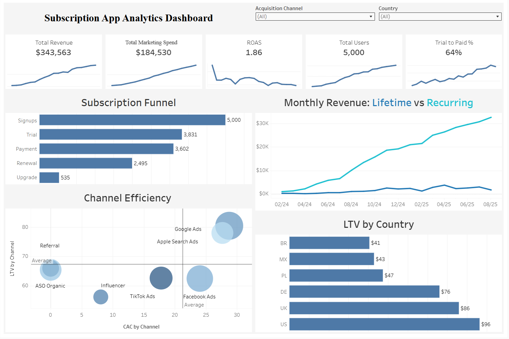

# Subscription App Analytics

End-to-end analysis of a mobile subscription app (English-learning), covering funnel drop-off, retention, and unit economics (LTV/CAC) across 6 countries and 6 acquisition channels.

**[📊 Live Tableau Dashboard](https://public.tableau.com/views/AppAnalytics_17839450693810/AppAnalytics?:language=en-GB&:sid=&:redirect=auth&:display_count=n&:origin=viz_share_link)** · **[📄 Full Report (PDF)](report/Subscription%20App%20Analysis%20by%20M.Hryshyna.pdf)** · **[🧮 Excel calculations](excel/Project.xlsx)** · **[💻 SQL queries](sql/queries.sql)**

> The underlying dataset is not publicly shared. SQL queries and full methodology are provided for transparency.

## Context

5,000 users, 23,020 transactions (Feb 2024 – Aug 2025), subscription funnel: Signup → Trial → Payment → Renewal → Upgrade.

Two business questions:
1. Where in the funnel do users drop off the most?
2. Which channels and countries deliver the best return on acquisition spend?

## Key Findings

- Biggest drop-offs: **Signup→Trial (23%)** and **Renewal→Upgrade (only 21% upgrade)**.
- **32%** of paying users convert without ever starting a trial — a distinct, underexplored conversion path.
- Retention stabilizes at a healthy **69%** from month 4 onward.
- The apparent LTV/CAC spread across countries (Brazil 7.7x vs Germany 3.2x) was mostly a **cost-attribution artifact** — once unallocated "Global" marketing spend is distributed proportionally, all six countries converge to **1.8–2.0x**.
- **Influencer marketing** has the lowest CAC ($8.39) and best LTV/CAC ratio (6.68) among paid channels.

## Tech Stack

- **SQL** (MySQL / DBeaver) — data auditing, funnel and cohort queries
- **Excel** — LTV/CAC calculations, cohort retention matrices, MRR breakdowns
- **Tableau Public** — interactive dashboard

## Methodology

Four source tables: `users`, `transactions`, `subscription_plans`, `marketing_spend`. Full methodology, including retention cohort logic and Global spend allocation, is documented in the [report](report/Subscription%20App%20Analysis%20by%20M.Hryshyna.pdf).

## Author

Marharyta Hryshyna
